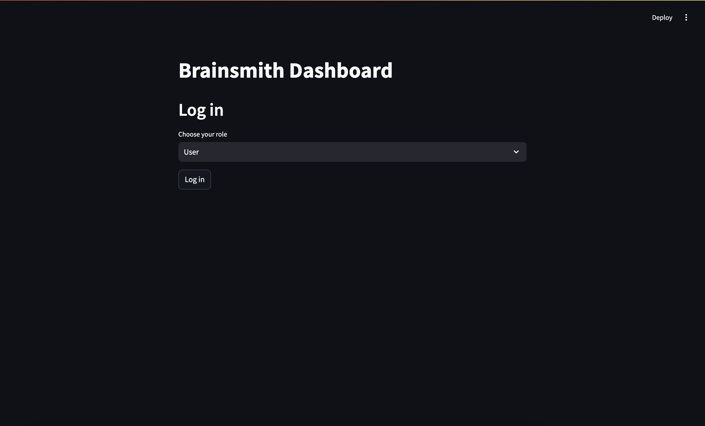

# brainsmith
Personal knowledge playground leveraging GenAI &amp; RAG.

## Prerequisite: Install the dependencies 
```shell
poetry install
# Copy the env example or create your own one
cp .env.example .env
```

## Dashboard User Guide

### Start up the backend app
```shell
poetry run uvicorn cortext.main:app
```

### Start up the ui for backend app (Like CMS/Playground)
```shell
PYTHONPATH=$(pwd) poetry run streamlit run cortex/ui.py
```

### Explore the Dashboard
1. Open the browser, go to [Brainsmith Dashboard](http://localhost:5701).

2. Login as admin.

3. Go to the Chat page, chat with your own knowledge base. (Choose OpenAI or Ollama as your chat provider)


**Note:** The default chat model for OpenAI is GPT-4, which is hard-coded to ensure the best user experience. For Ollama, you can choose your preferred model.

### Chat with your file
1. Upload and embed a file, give it a name. (Ollama is required)

2. Go to the chatbot page, select your embedding and chat with it.

3. Note that file must be txt or pdf as of now, more file extensions to be added.

## Development Guide

### Add dependencies to the poetry project
```shell
poetry add <package_name>
```

### Start up the backend app in reload mode
```shell
poetry run uvicorn app.main:app --reload
```

### Run the unit tests via pytest (with output print)
```shell
poetry run pytest -s
```

## To-Do List
- [ ] Add global settings page
- [ ] Support HTTP client for Chroma
- [ ] Provide second vector store provider
- [ ] Save job info to Redis
- [ ] Add progress page for embedding jobs
- [ ] Fix Ollama non-streaming issue when chatting with domain knowledge
- [ ] Show the retrieved context to the user along with AI answer
- [ ] Categories app logs based on different functions
- [ ] Others "TODO" or "FIXME" in the code